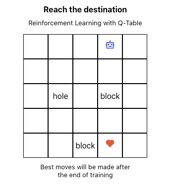
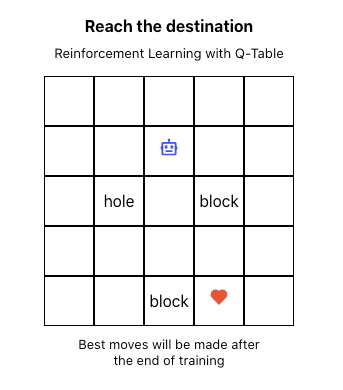
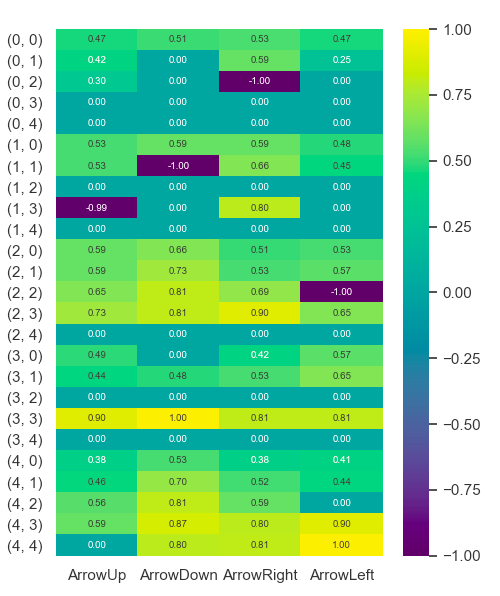
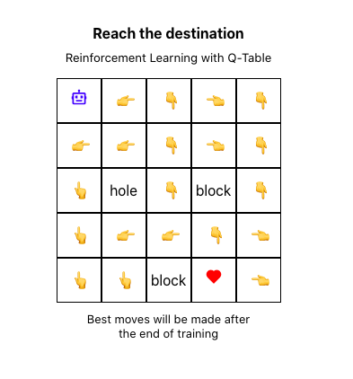

# Implementation of Q-Learning From Scratch

Q-Learning is one of the most basic reinforcement learing algorithms. Even so, they are mesmerizing when seen in action. This in my custom implemntation of algorithm **from scratch using numpy**.

**Blog:** Coming soon!

### Before Training

### After Training

### Q-Table

### Best Moves

----

# How to Run

You will need Python3.7+ environment and NPM for:

- FastAPI backend
- ReactJS frontend

1. In terminal, Goto `backend/` dir and run `python3 -m uvicorn main:app --reload --port 8099` to spawn the backend
2. In another terminal, Goto `game-one` and run `npm start` to spawn the React frontend
3. Chrome will open and the training procedure will start. After `50` games (about 3-4 mins) best moves will be made!

**Note:** You can change the port number and number of episodes(games for taining) in `api.js` and `main.py` respectively in case of any issues 

----

If you have any doubts, feel free to reach me out via [twitter](https://twitter.com/inf800)
